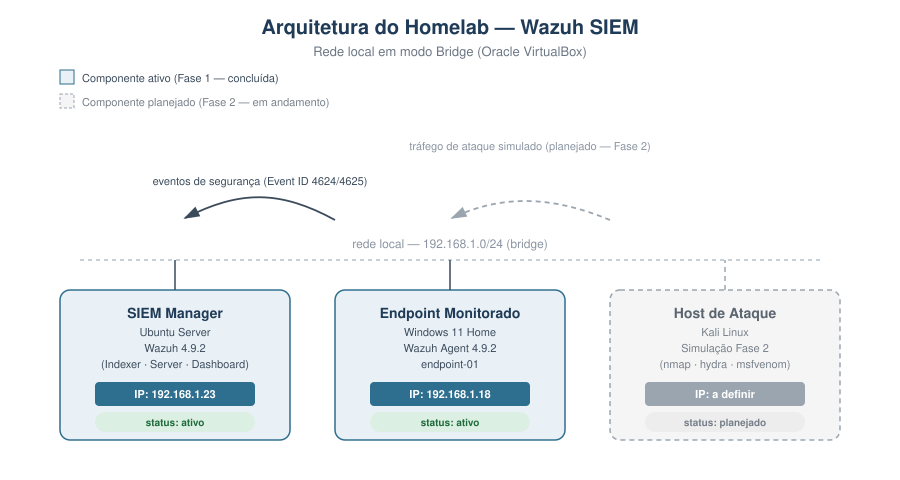
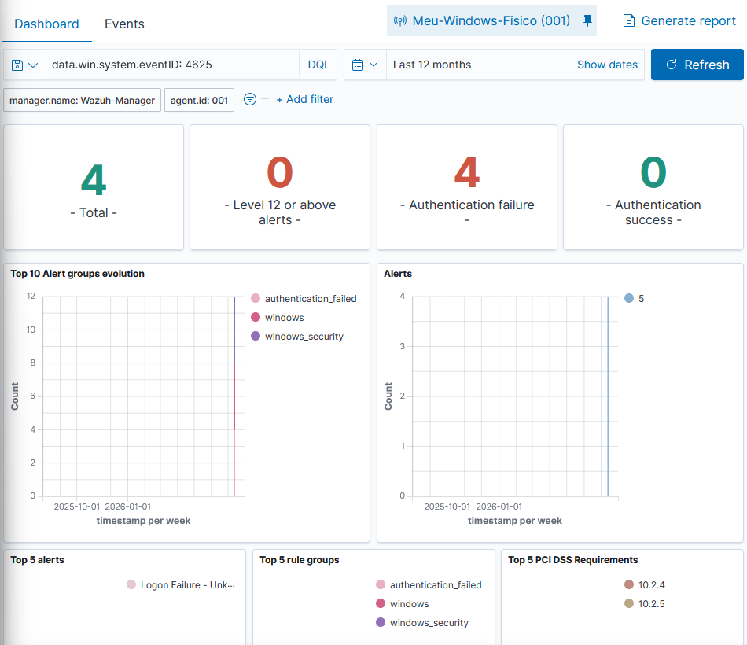
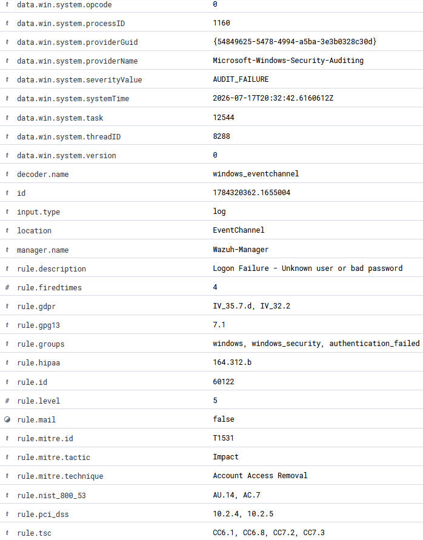

# Homelab de Detecção — Implementação e Análise com Wazuh SIEM

## Descrição

Homelab de segurança para prática de engenharia de detecção, coleta de telemetria de endpoints e triagem de alertas em ambiente controlado, usando Wazuh como SIEM.

O laboratório está dividido em duas fases:

- **Fase 1 (concluída):** centralização de logs, auditoria de autenticação e baseline de telemetria em endpoint Windows.
- **Fase 2 (em andamento):** simulação de ataques de rede com Kali Linux e validação de regras de correlação.

## Arquitetura

| Componente | Função | SO / Ferramenta | IP |
|---|---|---|---|
| SIEM Manager | Servidor central (Indexer, Server, Dashboard) | Ubuntu Server + Wazuh 4.9.2 | 192.168.1.23 |
| Endpoint monitorado | Alvo de auditoria e coleta de eventos | Windows 11 Home | 192.168.1.18 |
| Host de ataque (Fase 2) | Simulação de agente de ameaça | Kali Linux | a definir |

Ambiente virtualizado em Oracle VirtualBox, rede em modo Bridge para permitir comunicação direta entre VM e host físico.



---

## Fase 1 — Centralização de logs e auditoria local

### 1. Setup do servidor

Deploy do Wazuh (Indexer, Server e Dashboard) em instalação single-node, para fins de laboratório.

### 2. Deploy do agente no endpoint Windows

Instalação e registro do agente via PowerShell:

```powershell
# Download e instalação silenciosa do agente, apontando para o manager
Invoke-WebRequest -Uri https://packages.wazuh.com/4.x/windows/wazuh-agent-4.9.2-1.msi -OutFile $env:tmp\wazuh-agent; msiexec.exe /i $env:tmp\wazuh-agent /q WAZUH_MANAGER='192.168.1.23' WAZUH_AGENT_GROUP='default' WAZUH_AGENT_NAME='endpoint-01'

NET START WazuhSvc
```

**Validação:** agente registrado e ativo no manager, versão 4.9.2, comunicando com o node Wazuh.


*Painel de Agentes confirmando status `active`, SO (Windows 11 Home) e versão do agente instalada.*

### 2.1 Configuração do agente (`ossec.conf`, sanitizado)

A configuração parte do template padrão distribuído pelo Wazuh para agentes Windows. Os campos efetivamente personalizados para este ambiente foram o endereço do manager, o nome do agente e o enrollment automático; os demais módulos (FIM, SCA, syscollector) permanecem nos valores recomendados por padrão.

```xml
<ossec_config>

  <client>
    <server>
      <address>192.168.1.30</address>
      <port>1514</port>
      <protocol>tcp</protocol>
    </server>
    <config-profile>windows, windows10</config-profile>
    <crypto_method>aes</crypto_method>
    <notify_time>10</notify_time>
    <time-reconnect>60</time-reconnect>
    <auto_restart>yes</auto_restart>
    <enrollment>
      <enabled>yes</enabled>
      <agent_name>endpoint-01</agent_name>
      <groups>default</groups>
    </enrollment>
  </client>

  <!-- Coleta de eventos de segurança do Windows, com filtro de ruído
       recomendado pela documentação oficial do Wazuh -->
  <localfile>
    <location>Security</location>
    <log_format>eventchannel</log_format>
    <query>Event/System[EventID != 5145 and EventID != 5156 and EventID != 5447 and
      EventID != 4656 and EventID != 4658 and EventID != 4663 and EventID != 4660 and
      EventID != 4670 and EventID != 4690 and EventID != 4703 and EventID != 4907 and
      EventID != 5152 and EventID != 5157]</query>
  </localfile>

  <!-- File Integrity Monitoring — habilitado, valores padrão -->
  <syscheck>
    <disabled>no</disabled>
    <frequency>43200</frequency>
    ...
  </syscheck>

  <!-- Security Configuration Assessment — habilitado, scan a cada 12h -->
  <sca>
    <enabled>yes</enabled>
    <scan_on_start>yes</scan_on_start>
    <interval>12h</interval>
  </sca>

</ossec_config>
```

**O que foi omitido/sanitizado:** blocos completos de `syscheck` (listas extensas de diretórios e chaves de registro monitoradas, padrão do template) e os módulos `cis-cat` e `osquery`, que permanecem desabilitados (`disabled: yes`) e não foram utilizados neste laboratório. O arquivo completo não traz credenciais nem segredos — é composto majoritariamente por caminhos e parâmetros públicos do próprio produto.

### 3. Cenário de teste: falhas de autenticação local

**Ação executada:** bloqueio de sessão local (Windows+L), seguido de 4 tentativas de login com senha incorreta e 1 tentativa bem-sucedida.

**Objetivo do teste:** validar que o pipeline de coleta (Agent → Manager → Indexer → Dashboard) captura e classifica corretamente eventos de autenticação nativos do Windows.

**Resultado:** 4 eventos de falha (Event ID 4625) capturados e classificados pela regra Wazuh 60122, nível 5.


*Dashboard filtrado por `data.win.system.eventID: 4625`, mostrando o total de 4 alertas de falha de autenticação no período, sem falsos-negativos e sem eventos de sucesso indevidamente classificados como falha.*

### 4. Análise técnica do alerta (dados brutos)

Detalhamento do evento indexado, direto do Discover do Wazuh:




**Indicadores extraídos:**
- `logonType: 2` — logon interativo, executado localmente na máquina (não é acesso remoto).
- `eventID: 4625` / `status: 0xc000006d` — falha de autenticação por senha ou usuário incorretos.
- `logonProcessName: User32`, `processName: svchost.exe` — consistente com tela de logon padrão do Windows, sem indício de ferramenta externa de ataque.
- `rule.level: 5` — severidade baixa, compatível com um evento isolado e não crítico.

### 5. Análise do analista

Este é um evento de baixa severidade e alta previsibilidade: falha de autenticação local seguida de sucesso, mesmo usuário, mesmo host, curto intervalo de tempo. Classificado como **falso-positivo / atividade esperada** — consistente com erro de digitação do próprio usuário.

Se o volume de falhas fosse maior, viesse de IP externo, ou envolvesse `logonType: 3` (logon de rede) ou `logonType: 10` (RDP), a classificação mudaria para investigação ativa de possível brute-force (ver Fase 2). Não há ação de resposta necessária neste caso — o cenário serve para validar que o canal de telemetria funciona corretamente antes de introduzir cenários mais complexos.

### 6. Observação sobre o mapeamento MITRE do Wazuh

O print de detalhe do evento mostra que a própria regra 60122 do Wazuh mapeia este alerta para `rule.mitre.id: T1531` (Account Access Removal / tática Impact). Esse mapeamento é o **default do ruleset do Wazuh**, não uma classificação que eu atribuí manualmente — e, na minha avaliação, é impreciso para este cenário: T1531 descreve um adversário **removendo o acesso** de uma conta legítima (ex: trocar credenciais para bloquear a vítima), o que não é o que ocorre numa simples falha de senha digitada errada pelo próprio usuário.

Uma classificação tecnicamente mais correta para esse padrão de evento seria `T1110.001 — Brute Force: Password Guessing`, usada na tabela de mapeamento abaixo. Optei por manter e destacar essa divergência no README porque considero importante, como analista, não aceitar cegamente a rotulagem automática de uma ferramenta — o mapeamento MITRE de um SIEM é um ponto de partida para triagem, não a palavra final.

### 7. Mapeamento MITRE ATT&CK — Fase 1 (avaliação do analista)

| Tática | Técnica | Comportamento simulado | Telemetria de detecção |
|---|---|---|---|
| Credential Access | T1110.001 — Brute Force: Password Guessing | Múltiplas tentativas de senha incorreta na tela de bloqueio local | Event ID 4625, Logon Type 2, regra Wazuh 60122 |

*Nota: o evento não representa uma técnica ofensiva real (foi gerado pelo próprio operador do lab para validar o pipeline de coleta), mas o mapeamento demonstra como o mesmo padrão seria classificado caso ocorresse em um cenário real de força bruta local.*

---

## Fase 2 — Simulação de ataques de rede (em andamento)

> Esta fase ainda não foi executada. Descrição abaixo é o planejamento dos testes.

### Objetivo

Validar a capacidade de detecção do Wazuh contra vetores de ataque de rede, usando Kali Linux como host de origem.

### Testes planejados

| Tática MITRE | Técnica | Ferramenta | Detecção esperada |
|---|---|---|---|
| Reconnaissance | T1595.001 — Active Scanning: IP Addresses | `nmap` | Correlação de múltiplas conexões/porta em curto intervalo |
| Credential Access | T1110.002 — Brute Force: Password Cracking | `hydra` (RDP/SMB) | Event ID 4625, Logon Type 3, múltiplas falhas do mesmo IP |
| Execution | T1204.002 — User Execution: Malicious File | `msfvenom` (payload de teste, ambiente isolado) | Sysmon Event ID 1 (criação de processo), árvore de processo suspeita |

Integração planejada: Sysmon no endpoint Windows para auditoria de criação de processos, complementando os logs nativos de segurança.

---

## Como reproduzir este ambiente

1. Provisionar VM Ubuntu Server (mín. 4GB RAM) e instalar Wazuh (instalação single-node via script oficial).
2. Provisionar endpoint Windows (VM ou físico) e instalar o Wazuh Agent, apontando para o IP do manager.
3. Confirmar no dashboard que o agente está ativo e eventos de segurança estão sendo indexados.
4. Gerar os cenários de teste descritos na Fase 1 e validar a classificação dos alertas.

---

## Tecnologias utilizadas

- Wazuh SIEM 4.9.2 (Manager, Indexer, Dashboard)
- Windows 11 Home — endpoint monitorado
- Kali Linux — host de simulação de ataque (Fase 2)
- Oracle VirtualBox — virtualização
- PowerShell — automação de deploy do agente
